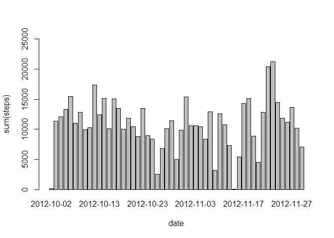
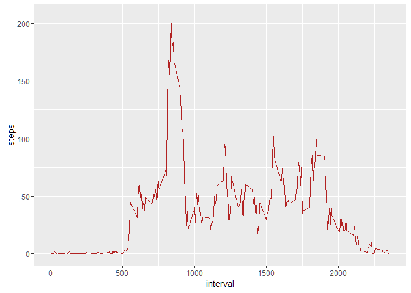
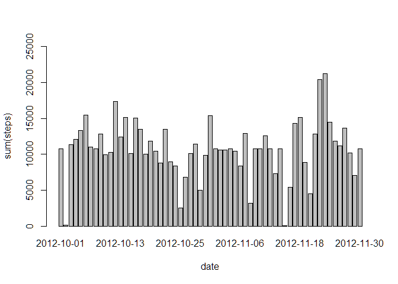
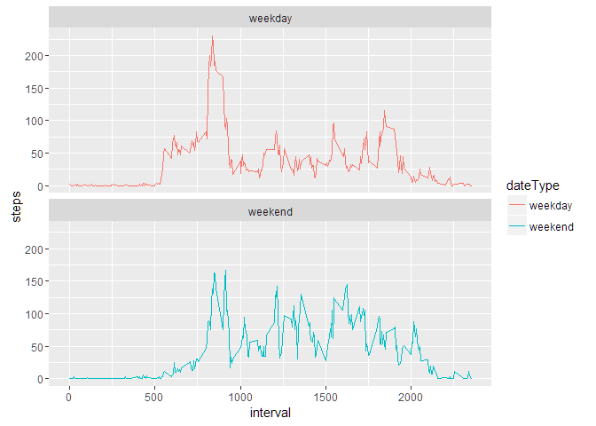

# Reproducible Research: Peer Assessment 1
## Loading packages


```r
library(knitr)
```

```
## Warning: package 'knitr' was built under R version 3.2.5
```

```r
library(dplyr)
```

```
## Warning: package 'dplyr' was built under R version 3.2.5
```

```
## 
## Attaching package: 'dplyr'
```

```
## The following objects are masked from 'package:stats':
## 
##     filter, lag
```

```
## The following objects are masked from 'package:base':
## 
##     intersect, setdiff, setequal, union
```

```r
library(lubridate)
```

```
## Warning: package 'lubridate' was built under R version 3.2.5
```

```
## 
## Attaching package: 'lubridate'
```

```
## The following object is masked from 'package:base':
## 
##     date
```

```r
library(ggplot2)
library(lattice)
```

```
## Warning: package 'lattice' was built under R version 3.2.4
```


## Loading and preprocessing the data

1. Load the data
2. Process/transform the data into a format suitable for my analysis


```r
if(!file.exists("activity.csv")){
  unzip("activity.zip")
}
activity <- read.csv("activity.csv", header= TRUE, sep=',', colClass=c("numeric", "character", "integer"))
```


## What is mean total number of steps taken per day?

The totla number of steps taken per day


```r
steps.date <-aggregate(steps~date, activity, sum)
head(steps.date)
```

```
##         date steps
## 1 2012-10-02   126
## 2 2012-10-03 11352
## 3 2012-10-04 12116
## 4 2012-10-05 13294
## 5 2012-10-06 15420
## 6 2012-10-07 11015
```

1. Make a histogram of the total number of steps taken each day


```r
barplot(steps.date$steps, names.arg=steps.date$date, ylim=c(0,25000),
        xlab="date", ylab="sum(steps)")
```

<!-- -->

2. Calculate and report the mean and median total number of steps taken per day


```r
mean(steps.date$steps)
```

```
## [1] 10766.19
```


```r
median(steps.date$steps)
```

```
## [1] 10765
```
Mean total number of steps taken per day is 10766.
Median total number of steps taken per day is 10765.


## What is the average daily activity pattern?


```r
steps.interval <- aggregate(steps~interval, activity, mean)
```

1. Make a time series plot (i.e. type = "l") of the 5-minute interval (x-axis) and the average number of steps taken, averaged across all days (y-axis)


```r
ggplot(steps.interval, aes(x=interval, y=steps)) +
  geom_line(color ="firebrick")
```

<!-- -->

2. Which 5-minute interval, on average across all the days in the dataset, contains the maximum number of steps?


```r
steps.interval[which.max(steps.interval$steps),]
```

```
##     interval    steps
## 104      835 206.1698
```
The maximum steps, on average, across all the days are 206 steps, interval 835.


## Imputing missing values

1. Calculate and report the total number of missing values in the dataset (i.e. the total number of rows with NAs)


```r
sum(is.na(activity$steps))
```

```
## [1] 2304
```
The number of missing values in the dataset is 2304.


2. Devise a strategy for filling in all of the missing values in the dataset. The strategy does not need to be sophisticated. For example, you could use the mean/median for that day, or the mean for that 5-minute interval, etc.

3. Create a new dataset that is equal to the original dataset but with the missing data filled in.


```r
revised <- activity
nas <- is.na(revised$steps)
avg_interval <- tapply(revised$steps, revised$interval, mean, na.rm=TRUE, simplify=TRUE)
revised$steps[nas] <- avg_interval[as.character(revised$interval[nas])]
```

checking if it's imputed properly.

```r
sum(is.na(revised$steps))
```

```
## [1] 0
```


4. Make a histogram of the total number of steps taken each day and Calculate and report the mean and median total number of steps taken per day. Do these values differ from the estimates from the first part of the assignment? What is the impact of imputing missing data on the estimates of the total daily number of steps?

* Histogram

```r
revised.date <- aggregate(steps~date, revised, sum)
barplot(revised.date$steps, names.arg=revised.date$date, ylim=c(0,25000),
        xlab="date", ylab="sum(steps)")
```

<!-- -->

* Mean

```r
mean(revised.date$steps)
```

```
## [1] 10766.19
```

* Median

```r
median(revised.date$steps)
```

```
## [1] 10766.19
```
The mean is same as the previous one, while median increased to 10766.19. the impact of imputing missing values doesn't seem to be significant because imputation uses mean for that particular day but steps are NA for that entire day.


## Are there differences in activity patterns between weekdays and weekends?

1. Create a new factor variable in the dataset with two levels -- "weekday" and "weekend" indicating whether a given date is a weekday or weekend day.


```r
revised$dateType <- ifelse(as.POSIXlt(revised$date)$wday %in% c(0,6), 'weekend', 'weekday')
```

2. Make a panel plot containing a time series plot (i.e. type = "l") of the 5-minute interval (x-axis) and the average number of steps taken, averaged across all weekday days or weekend days (y-axis). The plot should look something like the following, which was created using simulated data:


```r
steps.interval <- aggregate(steps ~ interval + dateType, revised, mean)
ggplot(steps.interval, aes(x=interval, y=steps, color=dateType)) + 
    geom_line() + 
    facet_wrap(~dateType, ncol=1, nrow=2)
```

<!-- -->
